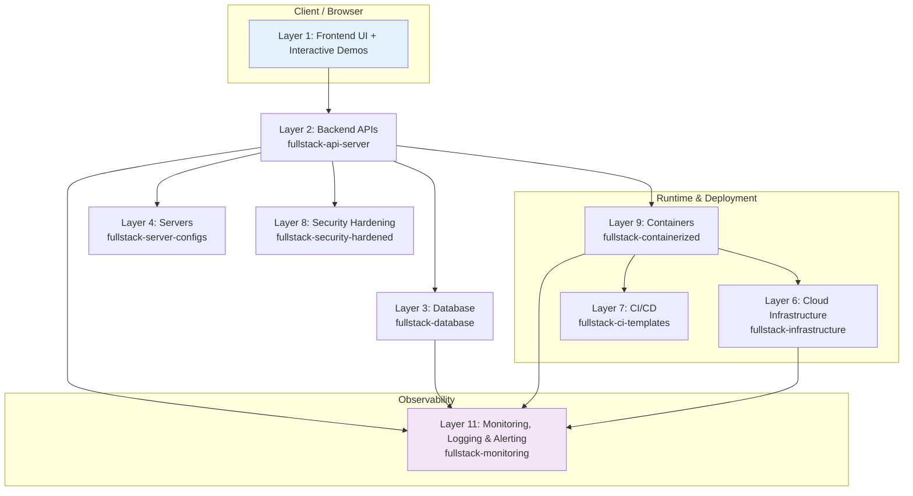

# Architecture Overview

**The Full Stack Observatory – 12 Layer Reference Architecture**

## Request / Data Flow (simplified)

1. Browser → **Layer 2 API** (Express)
2. API → **Layer 3 Database** (PostgreSQL)
3. All services expose health/metrics to **Layer 11 Monitoring**
4. Containers (**Layer 9**) run on **Layer 6 Infrastructure** (Terraform)
5. Everything is secured by **Layer 8** and configured via **Layer 4**
6. CI/CD (**Layer 7**) builds, tests, and deploys the whole stack

## All 12 Layers

1. Layer 1: Frontend UI and interactive demos
2. Layer 2: Backend APIs
3. Layer 3: Database
4. Layer 4: Servers and process management
5. Layer 5: Networking
6. Layer 6: Cloud infrastructure
7. Layer 7: CI/CD pipelines
8. Layer 8: Security hardening
9. Layer 9: Containers
10. Layer 10: CDN and edge delivery
11. Layer 11: Monitoring, logging, and alerting
12. Layer 12: Backups and recovery

**See the live interactive version** → [markusisaksson1982.github.io](https://markusisaksson1982.github.io/)

## Cross-Layer Integration Points

- `fullstack-monitoring` modules are imported directly into `fullstack-api-server`
- `fullstack-containerized` Dockerfiles reference configs from `fullstack-server-configs`
- Terraform modules in `fullstack-infrastructure` can deploy the containerized stack + monitoring
- All repos share consistent logging, health checks, and environment variable patterns
