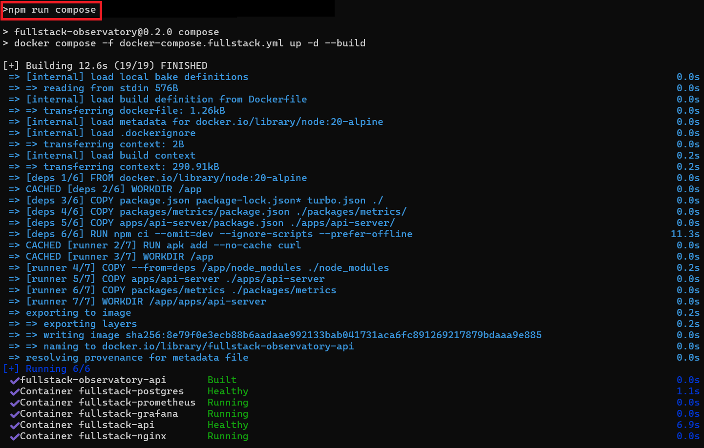
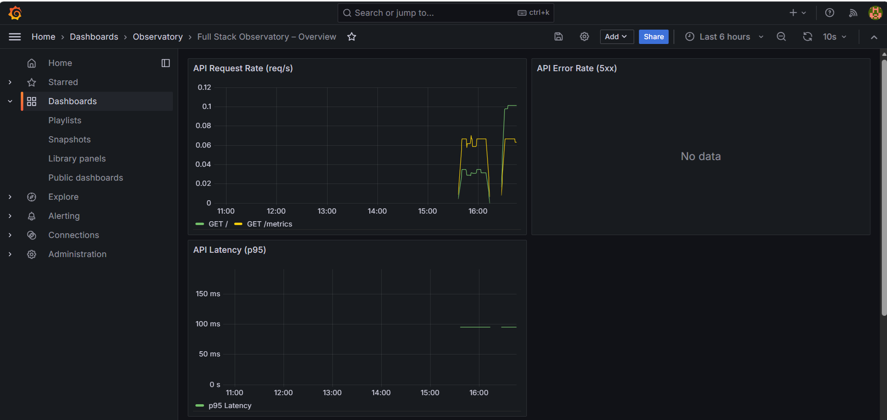
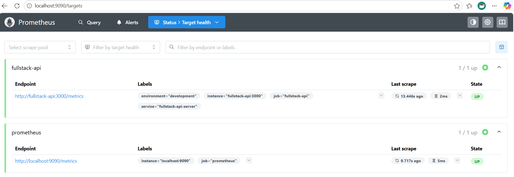

# Full Stack Observatory

**A production-grade, 12-layer observability showcase** — built as a living portfolio piece.

## Two Observatories – One Repository

This repository contains **two distinct but related observatories**:

| Observatory | Purpose | Tech Stack Highlights | Hero Use Case | Default Ports |
|------------|--------|---------------------|--------------|---------------|
| **Fullstack Observatory** (root) | Production backend patterns & full-stack reference architecture | Node.js/Express, Postgres, Nginx, Prometheus, Grafana, IaC, security hardening | General full-stack / DevOps / backend roles | `:3000` (web), `:8080` (API), `:9090` (Prometheus), `:3001` (Grafana) |
| **HPC-Observatory** (`hpc-observatory/`) | **Supplementary showcase** – GPU-aware PBS-style scheduler with real-time observability | Go scheduler + Python hooks, Next.js 15 dashboard, Prometheus metrics, Grafana dashboards | **HPC Scheduler Integration Engineer** + any observability / distributed-systems role | `:3002` (web), `:3003` (Grafana), `:8080` (scheduler), `:9090` (Prometheus) |

**HPC-Observatory** is the **visual hero** of the repo — the interactive Next.js dashboard with live job submission, node grid, and beautiful Grafana panels is what recruiters will remember.

The root Fullstack Observatory serves as the **foundational production reference** (API patterns, security, IaC, monitoring).

## Quick Start

### HPC-Observatory (Recommended First – The Showcase)

```bash
cd hpc-observatory
docker compose --profile hpc up -d
```

After ~30 seconds open:
- **http://localhost:3002** -> HPC Web Dashboard (the visual hero)
- **http://localhost:3003** -> Grafana (`admin` / `admin123`)
- **http://localhost:9090** -> Prometheus + HPC metrics
- **http://localhost:8080** -> Scheduler API

### Fullstack Observatory

```bash
cp .env.example .env
docker compose -f docker-compose.fullstack.yml up -d
```

After ~30 seconds open:
- **http://localhost** -> API (redirects to health)
- **http://localhost:3001** -> Grafana (`admin` / `admin123`)
- **http://localhost:9090** -> Prometheus + alerts

## Running Both Safely (No Port Conflicts)

The two observatories use **different ports** so they can run simultaneously:

```bash
# Terminal 1 – HPC-Observatory (recommended first)
cd hpc-observatory
docker compose --profile hpc up -d

# Terminal 2 – Fullstack Observatory
docker compose -f docker-compose.fullstack.yml -p fullstack up -d
```

Or run them one at a time (stop the other first):

```bash
# Stop HPC containers
docker stop hpc-*

# Start Fullstack Observatory
docker compose -f docker-compose.fullstack.yml up -d
```

## Review Paths

- Recruiters: [RECRUITER_SUMMARY.md](RECRUITER_SUMMARY.md)
- Engineers: [START_HERE.md](START_HERE.md)
- Hands-on reviewers: [COMPOSE.md](COMPOSE.md)
- HPC Recruiters: [HPC-Observatory Portfolio](hpc-observatory/docs/portfolio/RECRUITER_SUMMARY.md)

## What You Get

- Turborepo workspace repo with shared packages (`@observatory/*`)
- Layer 2: Express + Zod API with live metrics
- Layer 3: PostgreSQL + exporter
- Layer 4: Nginx + hardened configs
- Layer 8: Security hardening (Helmet, CSP, rate limiting, Zod)
- Layer 9: Multi-stage Dockerfiles
- Layer 11: Prometheus + Grafana + Alertmanager

## The 12 Layers

1. Layer 1: Frontend
2. Layer 2: Backend / APIs
3. Layer 3: Database
4. Layer 4: Servers
5. Layer 5: Networking
6. Layer 6: Cloud Infrastructure
7. Layer 7: CI/CD Pipelines
8. Layer 8: Security
9. Layer 9: Containers
10. Layer 10: CDN / Edge
11. Layer 11: Monitoring, Logging & Alerting
12. Layer 12: Backups & Recovery

## Screenshots





## Links

- [Interactive 12-Layer Explorer](https://markusisaksson1982.github.io/)
- [Architecture](ARCHITECTURE.md)
- [Start Here](START_HERE.md)
- [Recruiter Summary](RECRUITER_SUMMARY.md)
- [End-to-End Demo](COMPOSE.md)

---

Made as part of **The Full Stack Observatory**
